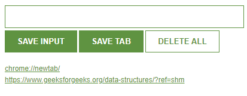
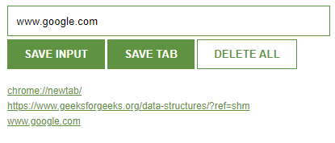

# Google-chrome-extension

SITE TRACKER is a google chrome extension which consists of three buttons :

- SAVE INPUT - to save the URLs manually
- SAVE TAB - to save the URL of the current window
- DELETE ALL - to delete all the saved URLs
  

## Logo

  

## How to use

- single click for saving
- double click for deleting
  

## Screenshots

  

## Tech Stack

HTML, CSS, JavaScript, JSON
  

## License

[MIT](https://choosealicense.com/licenses/mit/)